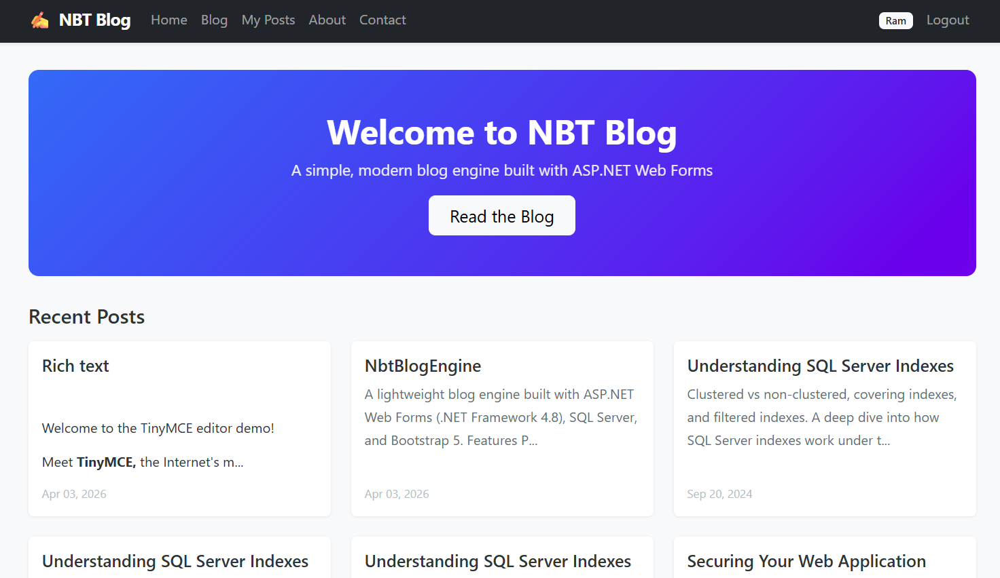
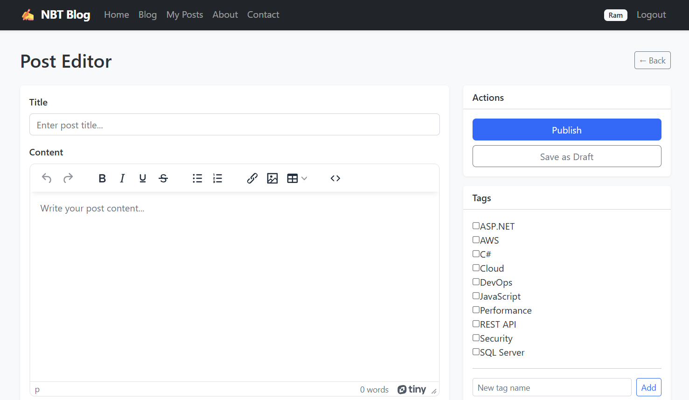

# Blog Engine using ASP.NET, C#, SQL Server, Bootstrap
`blog-engine-aspnet-sqlserver`

A lightweight blog engine built with ASP.NET Web Forms (.NET Framework 4.8), C#, SQL Server, and Bootstrap 5.



## Features

- Post creation, editing, publishing with auto-generated URL slugs
- Tag management and tag-based filtering
- Blog search (title + content)
- User authentication (login, signup, profile)
- Commenting system for logged-in users
- Responsive UI with Bootstrap 5



## Tech Stack

| Layer | Technology |
|-------|-----------|
| Frontend | ASP.NET Web Forms, Bootstrap 5.2.3, jQuery 3.7.0 |
| Backend | C# (.NET Framework 4.8) |
| Database | SQL Server Express |
| Data Access | ADO.NET with parameterized queries |
| Testing | MSTest with mock repositories |
| Static Analysis | StyleCop + FxCop Analyzers |

## Quick Start

1. Install **Visual Studio 2019+**, **.NET Framework 4.8**, and **SQL Server Express**
2. Run `sql/BlogDatabaseCreation.sql` then `sql/sp_GetPostsByAuthor.sql` against your SQL Server
3. Update the connection string in `src/NbtBlogEngine/Web.config`
4. Open `src/NbtBlogEngine/NbtBlogEngine.sln` → Restore NuGet Packages → `F5`

See [SETUP.md](SETUP.md) for detailed setup instructions.

## Documentation

| Document | Description |
|----------|-------------|
| [SETUP.md](SETUP.md) | Prerequisites, database setup, build & run instructions |
| [Architecture Doc](docs/architecture-doc.md) | Architecture, design patterns, data flow, schema, security, testing |
| [Coding Standards](docs/coding-standards.md) | Naming conventions, code style, SQL rules, architecture patterns |

## Project Structure

```
NbtBlogEngine/
├── docs/                        # Architecture documentation
├── sql/                         # Database creation & seed scripts
└── src/
    ├── NbtBlogEngine/           # Main web application
    │   ├── DataLayer/           # SqlHelper, SqlQueries
    │   ├── Models/              # DTOs (Post, User, Comment)
    │   ├── Repositories/        # Data access (interfaces + implementations)
    │   ├── Services/            # Business logic + ServiceFactory
    │   └── Helpers/             # SlugHelper, TextHelper, TagHelper
    └── NbtBlogEngine.Tests/     # Unit tests (MSTest) with mock repositories
```

## License

This project is for educational purposes.
